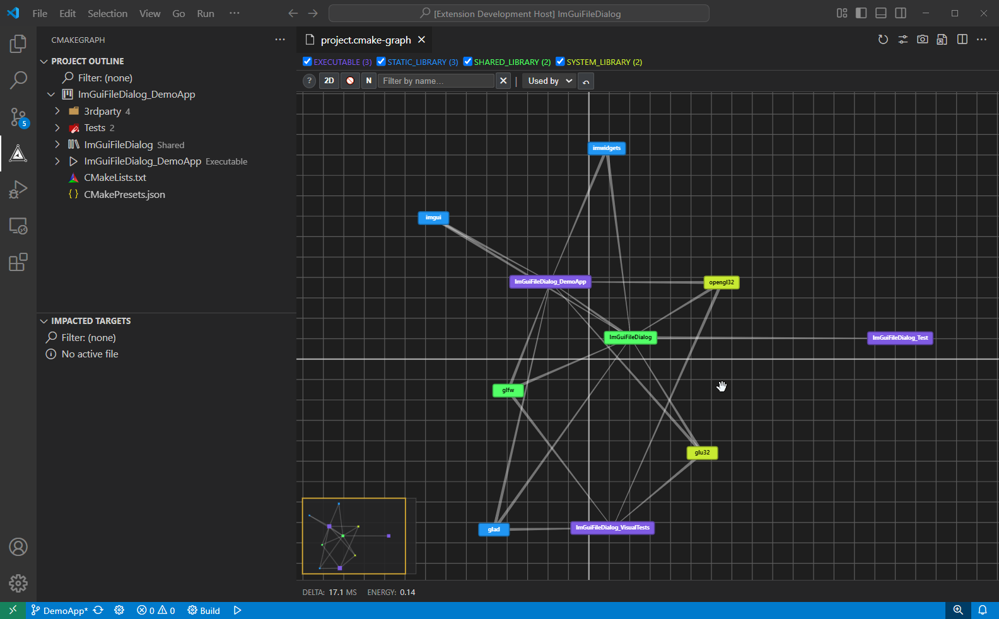
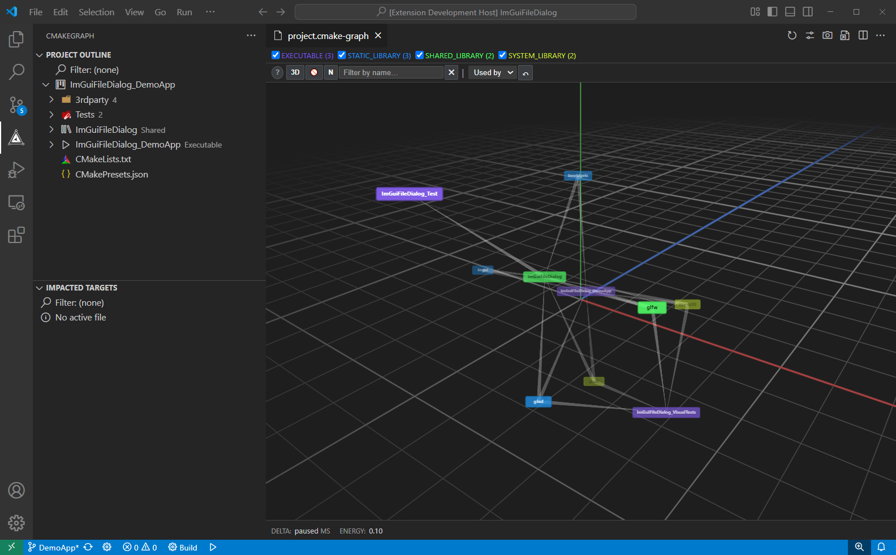
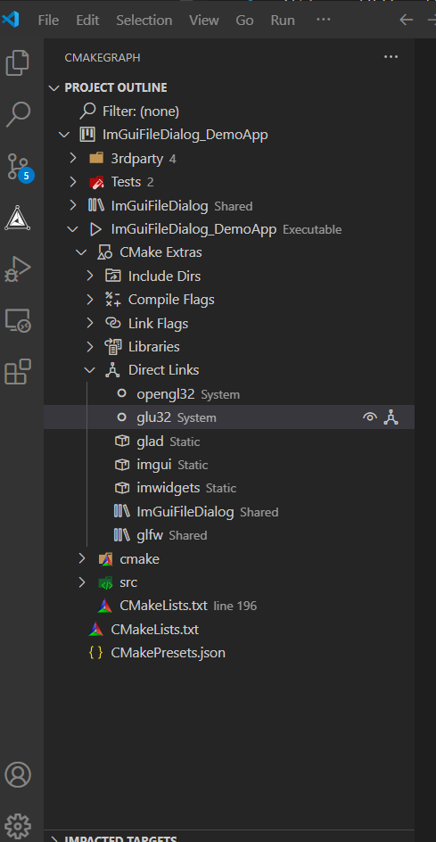
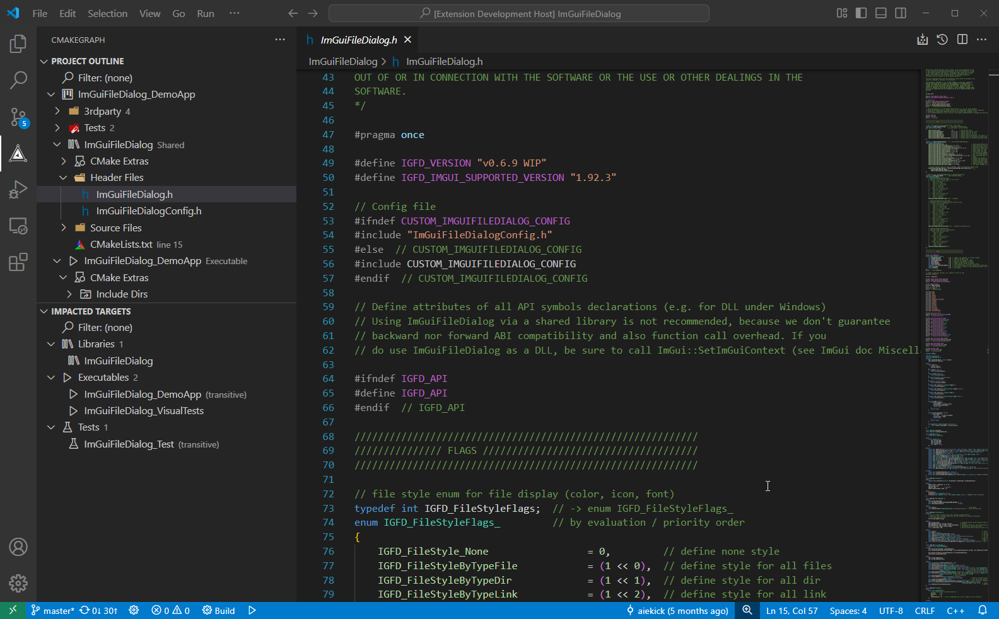

# CMakeGraph

CMake integration for VS Code via the **CMake File-Based API** -- no CMakeLists.txt parsing required.

## Philosophy

CMakeGraph takes a different approach from other CMake extensions: instead of parsing `CMakeLists.txt` files, it relies entirely on the [CMake File-Based API](https://cmake.org/cmake/help/latest/manual/cmake-file-api.7.html). This means CMakeGraph reads what CMake itself reports after a configure, giving you accurate project information regardless of how complex your CMake scripts are.

## Features

### Dependency Graph

An interactive force-directed graph that visualizes CMake target dependencies. The graph opens as an **editor tab** (not a sidebar panel), so it can be moved to another editor group or even another screen.

#### 2D

#### 3D

#### Features :

- **Open the graph** from the outline: click the graph icon on the project item for the full graph, or on any target (except UTILITY) for a focused sub-graph
- **Canvas-based rendering** with pan (click & drag background) and zoom (mouse wheel)
- **Light and dark theme support**: all graph elements (edges, grid, minimap, selection, indicators) adapt automatically to the active VS Code theme
- **Node interaction**: click a node to select it and highlight its edges, drag a node to reposition it
- **Node pinning**: pin a selected node so it stays in place during simulation. Pinned nodes are marked with a cyan border. Toggle pinning via the checkbox in the footer bar
- **Focused subgraph view**: double-click a node to explore only its recursively connected dependencies. A breadcrumb bar shows navigation history and lets you go back. The focused root node is highlighted with a golden halo and pinned at the origin, with sub-nodes arranged around it
- **Edge gradient**: when a node is selected, each connected edge shows a gradient from the base node's color to the foreground color
- **Double-click the background** to fit the entire graph in the view
- **Space bar** toggles the simulation on/off
- **Search & filter**: search nodes by name or file path. Two filter modes:
  - **Dim**: non-matching nodes are faded out
  - **Hide**: non-matching nodes are completely removed from the graph and simulation
- **Type filtering**: toggle visibility of target types (Executable, Static Library, etc.) via checkboxes in the header
- **Edge styles**: choose between Tapered, Chevrons, or Line in the settings panel
- **Edge direction**: show edges as "Used by" or "Is using" via the dropdown in the breadcrumb bar or the settings panel. Changing direction while in a focused subgraph rebuilds the visible nodes accordingly
- **Force simulation**: nodes are positioned automatically via a physics simulation with configurable parameters (repulsion, attraction, gravity, damping, etc.)
- **Editor toolbar** (top-right): Refresh, Settings, Screenshot, and CSV Export buttons
- **Settings panel** (gear icon): collapsible sections for Edges, Node Colors, Force Simulation, Display, and Controls. Includes:
  - Edge style and direction selectors
  - Color pickers to customize node colors per target type
  - Tapered edge width slider
  - All simulation parameter sliders with per-parameter reset buttons
  - Minimap toggle
  - Start/Stop, Restart, Fit to View, and Screenshot (PNG) buttons
- **CSV export**: exports the currently visible graph (respecting filters and focus) as a CSV file with columns: `node_a`, `type_a`, `link_type`, `node_b`, `type_b`
- **Minimap**: a small overview of the full graph in the corner, with interactive pan and zoom
- **Full workspace persistence**: all graph settings (colors, edge style, direction, simulation parameters, panel visibility, section collapse states) are saved in workspace settings and survive VS Code restarts

### Project Outline

A tree view of your project structure based on the CMake codemodel:

- Targets grouped by CMake folder structure (`set_property(GLOBAL PROPERTY USE_FOLDERS ON)`)
- Source files organized by source groups or directory structure
- Click any source file to open it in the editor
- Click any target to jump to its `add_executable`/`add_library` definition in CMakeLists.txt
- Build or rebuild individual targets directly from the outline via inline buttons
- **CMake Extras** sub-tree per target:
  - Include directories (user and system)
  - Compile flags and defines
  - Link flags
  - Linked libraries
  - Direct links (with readable type labels: Shared, Static, System, etc.). Double-click a direct link to navigate to that target in the outline
  - Target dependencies (with "Show in outline" navigation)
  - CMake input files
- **Graph integration**: inline graph icon on the project item (full graph) and on each target except UTILITY (sub-graph)
- Copy individual items or entire sections to the clipboard via right-click menu
- Filter by target name or type

### Impacted Targets

Shows which targets are affected when the file you are currently editing changes.

- **Transitive dependency resolution**: if you edit a file in `libA`, and `libB` depends on `libA` while `app` depends on `libB`, all three targets appear
- Direct targets are shown normally; transitive ones are marked *(transitive)*
- Three sections:
  - **Libraries** -- static, shared, module, object and interface libraries
  - **Executables** -- non-test executable targets
  - **Tests** -- test executables identified via CTest discovery
- Per-target inline buttons: **Build**, **Rebuild**, **Test**
- Per-section inline buttons: **Build section**, **Rebuild section**, **Test section**
- Hovering a test target shows the full list of associated CTest tests
- Filter by target name or type

### CTest Integration

Tests are discovered automatically after every configure by running `ctest --show-only=json-v1` in the background.

- Test executables are separated from normal executables in the Impacted Targets view
- Running tests on a single target or a whole section builds the appropriate `ctest -R` regex automatically from the discovered test names
- The tooltip on a test target lists all its associated CTest tests

### Diagnostics

CMake errors, warnings and deprecation notices from the configure step are parsed and shown:

- In the VS Code **Problems** panel, with file path and line number
- As file decorations (colored badges) in the Explorer and tree views:
  - **E** (red) for errors
  - **W** (yellow) for warnings
  - **D** (yellow) for deprecation warnings
- Parent directories propagate the highest severity from their children

### Output Panel

All CMake and CTest output is shown in a dedicated **CMakeGraph** output channel with optional syntax highlighting:

- Build progress (`[25/105]`)
- File paths, target names
- Error and warning messages
- Success / failure status

### CMake Tools Integration

CMakeGraph can work alongside the official CMake Tools extension. When CMake Tools triggers a configure, CMakeGraph automatically picks up the new build directory and build type, refreshing all panels with the latest project data.

### Task Management

- Status bar shows running tasks with a spinner
- Cancel individual tasks or all tasks at once
- Long-running silent operations (like test discovery) can also be cancelled

## Getting Started

1. **Install the extension** from the `.vsix` file or the marketplace.
2. **Open a CMake project** in VS Code.
3. Set the **build folder** via the command palette or let the extension auto-detect it.
4. Once the build directory contains CMake reply files (after a configure), all panels update automatically.

## Keyboard Shortcuts

| Shortcut | Command |
|----------|---------|
| `Ctrl+Shift+F7` | Configure |
| `Ctrl+F7` | Build |

## Settings

All settings are under the `CMakeGraph` prefix.

| Setting | Default | Description |
|---------|---------|-------------|
| `sourceDir` | `${workspaceFolder}` | Path to the CMake source directory |
| `buildDir` | `${workspaceFolder}/build` | Path to the CMake build directory |
| `cmakePath` | `cmake` | Path to the cmake executable |
| `ctestPath` | `ctest` | Path to the ctest executable |
| `cpackPath` | `cpack` | Path to the cpack executable |
| `clearOutputBeforeRun` | `true` | Clear the output panel before each CMake command |
| `showJobsOption` | `false` | Show the Jobs (parallelism) row in Build and Test sections |
| `defaultJobs` | `0` | Default number of parallel jobs (`0` = let CMake/CTest decide) |
| `colorizeOutput` | `true` | Enable syntax highlighting in the output panel |
| `graphEdgeDirection` | `dependency` | Edge arrow direction: `dependency` (child-to-parent) or `inverse` (parent-to-child) |
| `graphEdgeStyle` | `tapered` | Edge rendering style: `tapered`, `chevrons`, or `line` |
| `graphTaperedWidth` | `1.0` | Width multiplier for tapered edges (0.1 -- 5.0) |
| `graphNodeColors` | `{}` | Custom colors per target type (e.g. `{"EXECUTABLE": "#ff0000"}`) |
| `graphSimEnabled` | `true` | Enable the force simulation |
| `graphMinimap` | `true` | Show the minimap overlay |
| `graphSettingsVisible` | `false` | Whether the settings panel is open |

The `${workspaceFolder}` variable is supported and resolved automatically in path settings.

## How It Works

1. **Query files** are written to `.cmake/api/v1/query/` in the build directory
2. When you run **Configure**, CMake generates reply files in `.cmake/api/v1/reply/`
3. A **file watcher** detects new `index-*.json` files and triggers a reload
4. CMakeGraph reads the **codemodel**, **cmakeFiles**, and **toolchains** replies
5. All panels update with accurate project information straight from CMake

This approach means CMakeGraph works with any CMake project, regardless of complexity -- custom functions, generator expressions, FetchContent, ExternalProject, toolchain files -- everything is supported because CMake itself does the heavy lifting.

## Requirements

- VS Code >= 1.80.0
- CMake >= 3.14 (File-Based API support)
- CTest (bundled with CMake, used for test discovery)

## License

MIT -- see [LICENSE](LICENSE) for details.
